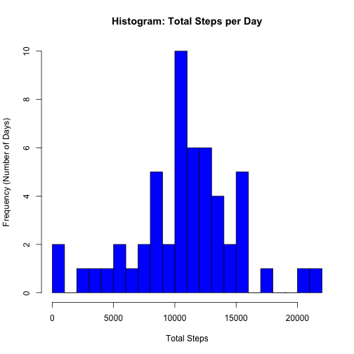
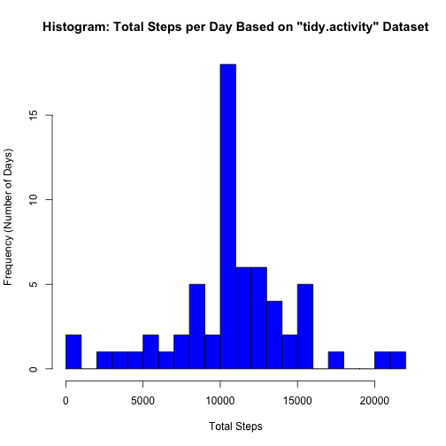
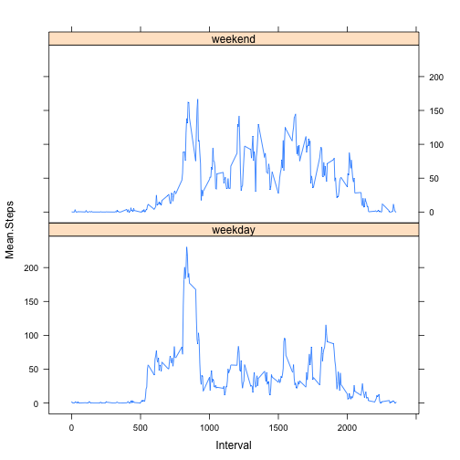

# Reproducible Research: Peer Assessment 1

Author: Jody P. Abney

Submission Due Date: 20-Jul-2014 7:30 PM EDT

##Description
This assignment makes use of data from a personal activity monitoring device 
such as a [Fitbit](http://www.fitbit.com/), 
[Nike Fuelband](http://www.nike.com/us/en_us/c/nikeplus-fuelband), or 
[Jawbone Up](https://jawbone.com/up). This device collects data at 5 minute 
intervals through out the day. The data consists of two months of data from an 
anonymous individual collected during the months of October and November, 2012 
and include the number of steps taken in 5 minute intervals each day.

## Assumptions/Prerequisites
* The basic directory structure begins consists of the following:
    * data - containing source data and analyzed data files
    * doc - containing instructions and finalized documentation
    * figures - containing figures produced from the analysis
    * instructions_fig - containing figures related to the instructions
    * Rcode - containing R code files used in thr analysis
    * Text - containing text, HTML, markdown, and Rmarkdown files

* Required libraries include: 
    * ggplot2
    * lattice
    * knitr

## Loading and preprocessing the data
Let's start by loading the necessary libraries:


```r
library(ggplot2)
library(lattice)
library(knitr)
```

#### 1. Load the data

```r
## read the activity.csv source data
activity <- read.csv("../data/activity.csv")
```

#### 2. Process/transform the data (if necessary) into a format suitable for your analysis

Execute a "head" command to review the first 10 rows of "activity" data

```r
head(activity, n = 10)
```

```
##    steps       date interval
## 1     NA 2012-10-01        0
## 2     NA 2012-10-01        5
## 3     NA 2012-10-01       10
## 4     NA 2012-10-01       15
## 5     NA 2012-10-01       20
## 6     NA 2012-10-01       25
## 7     NA 2012-10-01       30
## 8     NA 2012-10-01       35
## 9     NA 2012-10-01       40
## 10    NA 2012-10-01       45
```

Execute a "tail" command to get a view of the last 10 rows of "actvity" data

```r
tail(activity, tail = 10)
```

```
##       steps       date interval
## 17563    NA 2012-11-30     2330
## 17564    NA 2012-11-30     2335
## 17565    NA 2012-11-30     2340
## 17566    NA 2012-11-30     2345
## 17567    NA 2012-11-30     2350
## 17568    NA 2012-11-30     2355
```

Execute a 'summary' command to get a view of the data elements and any missing
values

```r
summary(activity)
```

```
##      steps               date          interval   
##  Min.   :  0.0   2012-10-01:  288   Min.   :   0  
##  1st Qu.:  0.0   2012-10-02:  288   1st Qu.: 589  
##  Median :  0.0   2012-10-03:  288   Median :1178  
##  Mean   : 37.4   2012-10-04:  288   Mean   :1178  
##  3rd Qu.: 12.0   2012-10-05:  288   3rd Qu.:1766  
##  Max.   :806.0   2012-10-06:  288   Max.   :2355  
##  NA's   :2304    (Other)   :15840
```

Given the number of missing data "NA", care must be exercised to deal with these
missing values in later assignment points.

## What is mean total number of steps taken per day?

*Note: Ignoring missing values in the activity dataset for this section of the analysis*

### 1. Make a histogram of the total number of steps taken per day


```r
#### Aggregate the total steps per day data
steps <- with(activity,
              aggregate(steps,
                        by = list(date),
                        sum
              )
) # returns "date" and "total steps per day" data

## Set up the column names
names(steps) <- c("Date", 
                  "Total.Steps")

## Plot the histogram of the total number of steps taken each day
with(steps, 
     hist(Total.Steps, 
          col = "blue", 
          breaks = 30,
          main = "Histogram: Total Steps per Day",
          xlab = "Total Steps",
          ylab = "Frequency (Number of Days)"
     )
)
```

 

### 2. Calculate and report the **mean** and **median** total number of steps taken per day


```r
#### Mean of total steps (must ignore NA values)
steps.mean <- mean(steps$Total.Steps, na.rm = TRUE)
cat("Mean of Total Steps per Day is", steps.mean)
```

```
## Mean of Total Steps per Day is 10766
```

```r
#### Median of total steps (must ignore NA values)
steps.median <- median(steps$Total.Steps, na.rm = TRUE)
cat("Median of Total Steps per Day is", steps.median)
```

```
## Median of Total Steps per Day is 10765
```


## What is the average daily activity pattern?

*Note: Still ignoring missing values in the activity dataset for this section of the analysis because imputing missing values is the next section of the assignment*


#### 1. Make a time series plot (i.e. type = "l") of the 5-minute interval (x-axis) and the average number of steps taken, averaged across all days (y-axis)


```r
# Filter for only complete data ignoring the missing values Imputing Missing
# Values is the next section of the assignment
cleaned.activity <- activity[complete.cases(activity),]

# Calculate the mean steps across all dates by the 5-minute interval
ts.plot.data <- with(cleaned.activity,
                     aggregate(steps,
                               list(interval),
                               FUN = mean))

# Setup appropriate names for the aggregated data
names(ts.plot.data) <- c("Interval", "Mean.Steps")

# Create the time-series plot plot
ts.plot <- with(ts.plot.data,
                plot(x = Interval,
                     y = Mean.Steps,
                     type = "l")
                )
```

 

#### 2. Which 5-minute interval, on average across all the days in the dataset, contains the maximum number of steps?


```r
max.mean <- subset(ts.plot.data, ts.plot.data$Mean.Steps == max(ts.plot.data$Mean.Steps))
cat("The maximum mean steps is", min(max.mean[2]), "for 5-minute time interval", max(max.mean[1]))
```

```
## The maximum mean steps is 206.2 for 5-minute time interval 835
```

## Imputing missing values

#### 1. Calculate and report the total number of missing values in the dataset (i.e. the total number of rows with NAs)

```r
incomplete <- activity[!(complete.cases(activity)),]
cat("Total number of rows with NAs in the 'activity' dataset:", nrow(incomplete))
```

```
## Total number of rows with NAs in the 'activity' dataset: 2304
```

#### 2. Devise a strategy for filling in all of the missing values in the dataset. The strategy does not need to be sophisticated. For example, you could use the mean/median for that day, or the mean for that 5-minute interval, etc.

The strategy used for imputing missing values was to use the mean of the 5-minute 
interval that corresponds to the NA value
    1. Make a copy of the activity data without the missing value rows
    2. Compute the "mean" of the steps for each 5-minute interval across
    all of the days
    3. Replace the missing values with the mean for that specific 5-minute
    interval
    4. The dataset with imputed values is named "tidy.activity"

#### 3. Create a new dataset that is equal to the original dataset but with the missing data filled in.


```r
# make a copy of activity without the missing data rows
temp <- activity[!(is.na(activity$steps)),]

missing.mean.5 <- with(temp, 
               aggregate(steps, 
                         by = list(interval), 
                         FUN = mean))
names(missing.mean.5) <- c("interval", "Missing.Mean.Interval")

###### Replace the missing values with the missing.mean.5 value
tidy.activity <- activity

for(i in 1:nrow(tidy.activity)) { #
    if(is.na(tidy.activity$steps[i])) {
        temp.5 <- tidy.activity$interval[i]
        
        ## Calculate the lookup row in missing.mean.5
        for(j in 1:nrow(missing.mean.5)) {
            if(temp.5 == missing.mean.5$interval[j]) {
                tidy.activity$steps[i] <- 
                    missing.mean.5$Missing.Mean.Interval[j]
            }
        }
    }
}
```
Verify missing values are now imputed by executing the 'summary' command on the
"tidy.acvitity" dataset to ensure no NA values remain


```r
summary(tidy.activity)
```

```
##      steps               date          interval   
##  Min.   :  0.0   2012-10-01:  288   Min.   :   0  
##  1st Qu.:  0.0   2012-10-02:  288   1st Qu.: 589  
##  Median :  0.0   2012-10-03:  288   Median :1178  
##  Mean   : 37.4   2012-10-04:  288   Mean   :1178  
##  3rd Qu.: 27.0   2012-10-05:  288   3rd Qu.:1766  
##  Max.   :806.0   2012-10-06:  288   Max.   :2355  
##                  (Other)   :15840
```

#### 4a. Make a histogram of the total number of steps taken each day


```r
total.tidy.activity <- with(tidy.activity,
                            aggregate(steps,
                                      by = list(date),
                                      sum
                            )
)
names(total.tidy.activity) <- c("Date", "Total.Steps")

with(total.tidy.activity, 
     hist(Total.Steps, 
          col = "blue", 
          breaks = 30,
          main = "Histogram: Total Steps per Day Based on \"tidy.activity\" Dataset",
          xlab = "Total Steps",
          ylab = "Frequency (Number of Days)"
     )
)
```

 

#### 4b. Calculate and report the mean and median total number of steps taken per day. 

```r
#### Mean of total steps (must ignore NA values)
steps.mean <- mean(total.tidy.activity$Total.Steps)
cat("Mean of Total Steps per Day based on \"tidy.activity\" dataset is", steps.mean)
```

```
## Mean of Total Steps per Day based on "tidy.activity" dataset is 10766
```

```r
#### Median of total steps (must ignore NA values)
steps.median <- median(total.tidy.activity$Total.Steps)
cat("Median of Total Steps per Day based on \"tidy.activity\" dataset is", steps.median)
```

```
## Median of Total Steps per Day based on "tidy.activity" dataset is 10766
```

#### 4c. Do these values differ from the estimates from the first part of the assignment? 

Only the median is different which reflects the "averaging strategy" used for imputing missing values

#### 4d. What is the impact of imputing missing data on the estimates of the total daily number of steps?

Imputing missing values moved the median to the mean value.


## Are there differences in activity patterns between weekdays and weekends?

#### 1. Create a new factor variable in the dataset with two levels – “weekday” and “weekend” indicating whether a given date is a weekday or weekend day.


```r
tidy.activity$Weekday <- weekdays(as.Date(tidy.activity$date))
tidy.activity$Day.Type <- ifelse(weekdays(as.Date(tidy.activity$date)) %in% c("Saturday", "Sunday"), 
                                 "weekend", 
                                 "weekday")
```

#### 2. Make a panel plot containing a time series plot (i.e. type = "l") of the 5-minute interval (x-axis) and the average number of steps taken, averaged across all weekday days or weekend days (y-axis).


```r
temp <- tidy.activity
temp$Weekday <- weekdays(as.Date(temp$date))
temp$Day.Type <- ifelse(weekdays(as.Date(temp$date)) %in% c("Saturday", "Sunday"), "weekend", "weekday")

mean.5.day.type <- with(temp[!is.na(temp$steps),], 
                        aggregate(steps,
                                  by = list(Day.Type, interval),
                                  FUN = mean))
names(mean.5.day.type) <- c("Day.Type",
                            "Interval",
                            "Mean.Steps")

xyplot(Mean.Steps ~ Interval | Day.Type, 
       mean.5.day.type, 
       type = "l", 
       layout = c(1,2))
```

 

